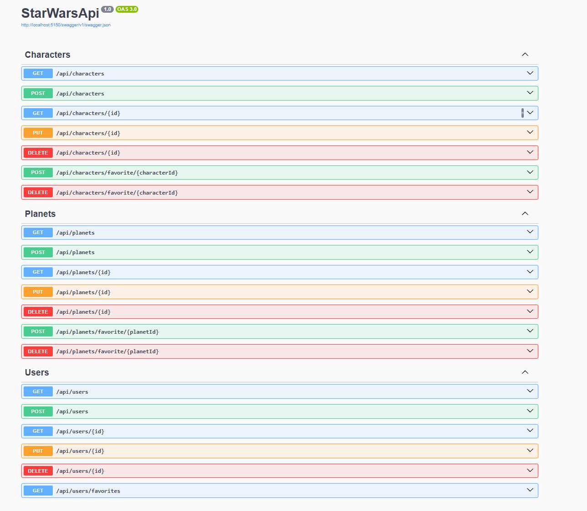
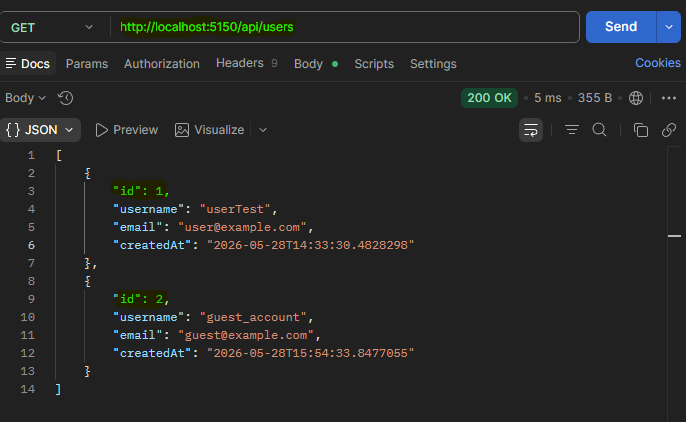
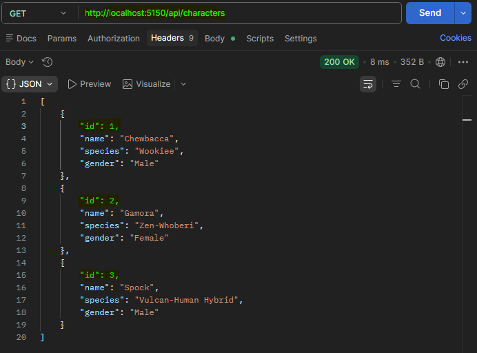
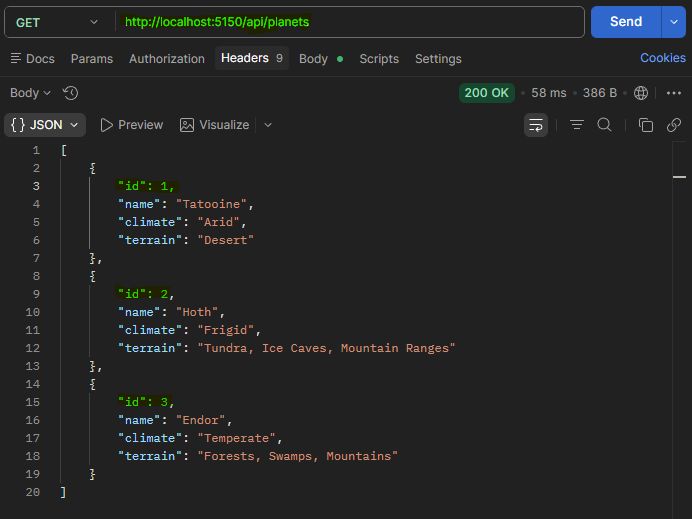
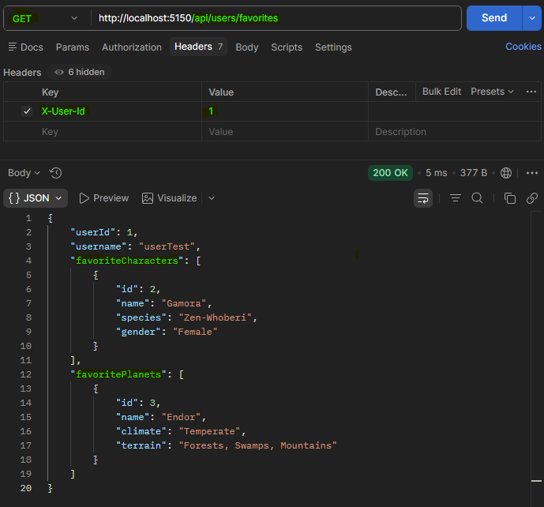
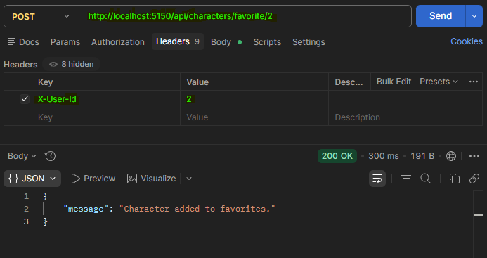

# Star Wars API

API REST para gestionar personajes, planetas y favoritos del universo Star Wars. Construida con **ASP.NET Core 9** y **Entity Framework Core** con **SQLite**.

## Tecnologias

| Tecnologia                  | Version  |
|-----------------------------|----------|
| .NET                        | 9.0      |
| ASP.NET Core                | 9.0      |
| Entity Framework Core       | 9.0.16   |
| SQLite                      | 9.0.16   |
| Swagger / Swashbuckle       | 9.0.6    |

> **Codespaces:** La primera vez que abras el proyecto, espera a que termine de cargar el contenedor y las extensiones. Una vez listo, ejecuta `dotnet run`.

## Ejecutar el proyecto

```bash
dotnet run
```

La API se levanta con Swagger habilitado en `http://localhost:****/swagger`.

## Documentacion Swagger



## Capturas

### Todos los usuarios



### Todos los personajes



### Todos los planetas



### Favoritos que pertenecen al usuario actual



### Nuevo personaje favorito del usuario actual



## Estructura del proyecto

```
StarWarsApi/
├── Program.cs
├── DTOs.cs
├── appsettings.json
├── appsettings.Development.json
├── Data/
│   └── StarWarsDbContext.cs
├── Models/
│   ├── User.cs
│   ├── Character.cs
│   ├── Planet.cs
│   ├── FavoriteCharacter.cs
│   └── FavoritePlanet.cs
├── Endpoints/
│   ├── Users.cs
│   ├── Characters.cs
│   └── Planets.cs
├── Helpers/
│   ├── PasswordHasher.cs
│   └── UserHelper.cs
└── assets/
    └── *.png
```

## Endpoints

| Metodo  | Ruta                                    | Descripcion                            |
|---------|-----------------------------------------|----------------------------------------|
| `GET`   | `/api/users`                            | Listar todos los usuarios              |
| `GET`   | `/api/users/{id}`                       | Obtener usuario por ID                 |
| `POST`  | `/api/users`                            | Crear usuario                          |
| `PUT`   | `/api/users/{id}`                       | Actualizar usuario                     |
| `DELETE`| `/api/users/{id}`                       | Eliminar usuario                       |
| `GET`   | `/api/users/favorites`                  | Obtener favoritos del usuario actual   |
| `GET`   | `/api/characters`                       | Listar todos los personajes            |
| `GET`   | `/api/characters/{id}`                  | Obtener personaje por ID               |
| `POST`  | `/api/characters`                       | Crear personaje                        |
| `PUT`   | `/api/characters/{id}`                  | Actualizar personaje                   |
| `DELETE`| `/api/characters/{id}`                  | Eliminar personaje                     |
| `POST`  | `/api/characters/favorite/{id}`         | Agregar personaje a favoritos          |
| `DELETE`| `/api/characters/favorite/{id}`         | Quitar personaje de favoritos          |
| `GET`   | `/api/planets`                          | Listar todos los planetas              |
| `GET`   | `/api/planets/{id}`                     | Obtener planeta por ID                 |
| `POST`  | `/api/planets`                          | Crear planeta                          |
| `PUT`   | `/api/planets/{id}`                     | Actualizar planeta                     |
| `DELETE`| `/api/planets/{id}`                     | Eliminar planeta                       |
| `POST`  | `/api/planets/favorite/{id}`            | Agregar planeta a favoritos            |
| `DELETE`| `/api/planets/favorite/{id}`            | Quitar planeta de favoritos            |

> **Nota:** Los endpoints de favoritos requieren el header `X-User-Id` con el ID del usuario.

## Seguridad

- Las contrasenas se almacenan hasheadas con **PBKDF2** (SHA256, 100,000 iteraciones + salt).
- Los endpoints GET de usuarios **no retornan** el campo `password`.
- Se utilizan **DTOs separados** para entrada y respuesta en todas las entidades.
- Manejo global de errores con `UseExceptionHandler`.
